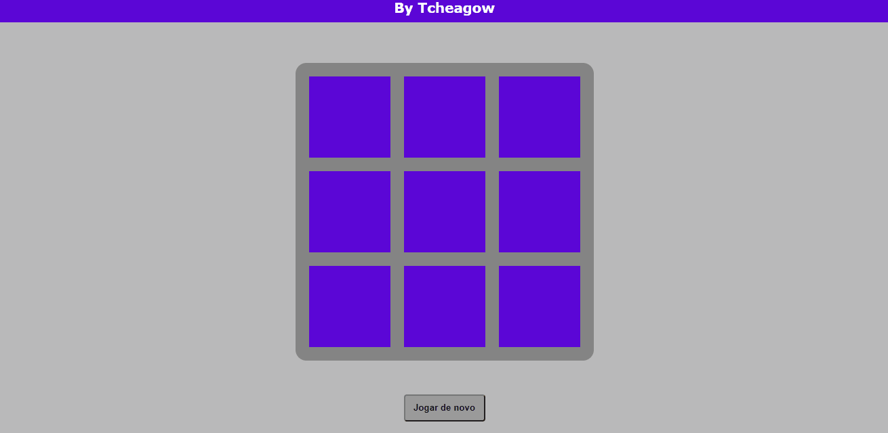

# Jogo-Da-Velha-JS-HTML-CSS

<h1 align="center">
    
</h1>
<h2> Tecnologias: </h2>
<li> HTML</li>
<li> CSS</li>
<li> JavaScript</li>
<li> LocalStorage</li>
 
<h2> Funcionalidades:</h2>
<li> Singlepayer (Um jogador)</li>
<li> Pode-se jogar em qualquer navegador </li>
<li> Todas as funcionalidade de um jogo da velha comum </li>
 
<h1> Link do site:</h1>
<a> https://tcheagow.github.io/Jogo-Da-Velha-JS-HTML-CSS/ </a>
 
 
<h2> Feito por Tcheagow</h2>

